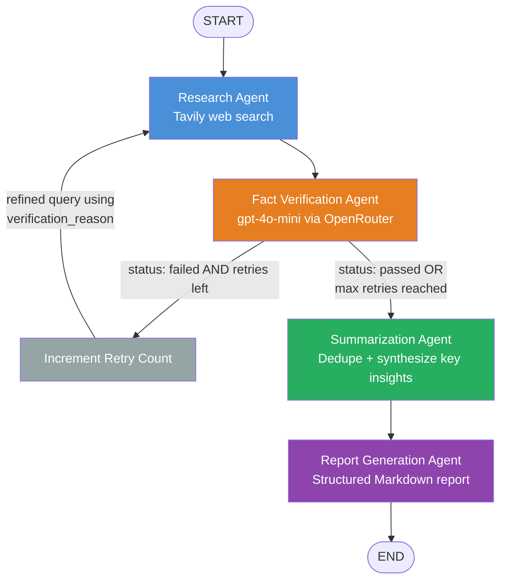
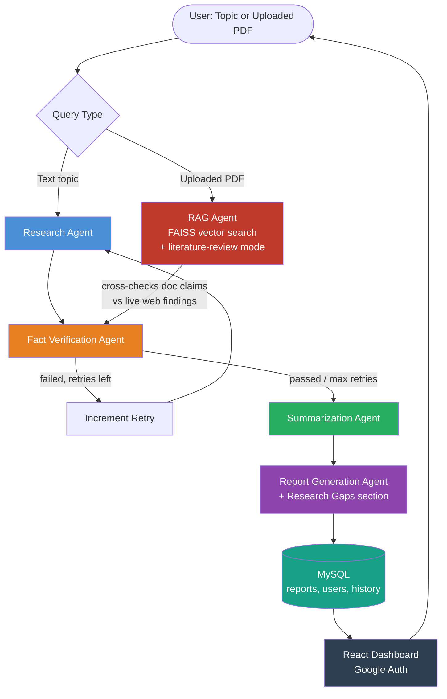

# ResearchMate — AI Based Multi-Agent Research and Report Generation System

A multi-agent Agentic AI system that automates the research-to-report workflow: gathering information, verifying credibility, synthesizing findings, and generating a structured, cited report — with a self-correcting fact-verification loop that distinguishes it from a single-LLM-call or static-pipeline tool.

**Status:** Phase 2 of 6 complete (as of current build).

---

## 1. Problem Statement

Researchers and students spend excessive time searching multiple sources, verifying credibility manually, and compiling findings into structured reports. Single-model AI chatbots can summarize text but cannot verify their own output or retry when information is weak or contradictory.

ResearchMate addresses this with specialized, collaborating agents — each responsible for one part of the workflow — coordinated through LangGraph, including an independent Fact Verification Agent that can send work back for re-research when it fails quality checks.

---

## 2. Team

| Role | Name |
|---|---|
| Faculty Mentor | Mr. P.K. Sharma |
| Team Member 1 | Pulkit Kher (BTECH/25095/23, 7B) |
| Team Member 2 | Shivansh Akar (BTECH/25115/23, 7B) |

---

## 3. Architecture Overview

### 3.1 Current Graph (Phase 1 + Phase 2 complete)



**The re-search loop (Verify → Increment Retry → Research) is the project's core technical differentiator.** It proves the system is genuinely agentic — capable of judging its own output and autonomously correcting course — rather than a fixed sequential chain of LLM calls.

### 3.2 Planned Full Architecture (all 6 phases)



---

## 4. Agents

| Agent | File | Responsibility | Status |
|---|---|---|---|
| Research Agent | `agents/research_agent.py` | Searches the web via Tavily (`search_depth="advanced"`). Refines query using verification failure reason on retries. | ✅ Done |
| Fact Verification Agent | `agents/verification_agent.py` | Judges relevance, credibility, and cross-source agreement via gpt-4o-mini. Returns structured JSON. Routes back to Research Agent on failure. | ✅ Done |
| Summarization Agent | `agents/summarization_agent.py` | Deduplicates and synthesizes verified findings into concise bullet-point insights. Handles empty-findings case gracefully. | ✅ Done |
| Report Generation Agent | `agents/report_generation_agent.py` | Compiles summary + sources into a structured Markdown report: Introduction, Key Findings, **Research Gaps & Open Questions**, Sources, Conclusion. | ✅ Done |
| RAG Agent | `agents/rag_agent.py` | Answers questions from user-uploaded PDFs via FAISS. Literature-review mode extracts methodology/dataset/results into comparison tables. Cross-checks document claims against live web findings. | ⏳ Phase 3 |

---

## 5. State Schema (`state.py`)

```python
class ResearchState(TypedDict):
    topic: str
    search_results: list
    all_findings: list
    verification_status: str
    verification_reason: str
    retry_count: int
    max_retries: int
    summary: list          # bullet-point key insights
    final_report: str      # compiled Markdown report
```

---

## 6. Tech Stack

| Layer | Technology |
|---|---|
| Orchestration | LangGraph |
| LLM | GPT-4o-mini via OpenRouter |
| Web Search | Tavily API |
| Vector Store | FAISS |
| Backend | FastAPI |
| Database | MySQL (phpMyAdmin / cPanel) |
| Frontend | React |
| Auth | Google Auth (planned) |
| Deployment | Docker → AWS EC2 (t2.micro/t3.micro, free tier) + cPanel-hosted MySQL |
| Dev Environment | Windows, Git Bash, Python venv |

---

## 7. Six-Phase Build Plan

1. ✅ Research Agent + Fact Verification Agent loop (LangGraph) — core differentiator
2. ✅ Summarization Agent + Report Generation Agent
3. ⏳ RAG Agent (FAISS) with literature-review mode
4. ⏳ FastAPI + MySQL backend (incl. API key rotation)
5. ⏳ React Frontend + Google Auth dashboard
6. ⏳ Docker + AWS/cPanel deployment

---

## 8. Special Features (Differentiators)

1. **Automatic re-search loop** — Verification Agent triggers targeted re-search on failure via LangGraph conditional routing (not a static pipeline).
2. **Research Gap Identification** — Report Generation Agent explicitly surfaces unresolved/underexplored areas, framed honestly (no fabrication when data is insufficient).
3. **Literature-review mode** *(Phase 3)* — RAG Agent extracts methodology, datasets, and results from uploaded PDFs into comparison tables.
4. **Document-vs-web contradiction flagging** *(Phase 3)* — RAG Agent cross-checks user-uploaded document claims against live web research.
5. **Source ranking with justification** *(planned polish)* — small addition to Verification/Report agents explaining why each source matters.

**Positioning:** framed as a *literature review assistant*, not a generic report generator — a stronger, more defensible pitch requiring no extra technical work.

---

## 9. Testing Log

| Test | Topic | Result |
|---|---|---|
| Phase 1 success path | Real topic | ✅ Findings accumulate correctly |
| Phase 1 failure path | Nonsense topic | ✅ Fails 3x with distinct reasons, refines query each retry, stops cleanly at max_retries, 0 fabricated findings |
| Phase 2 success path | "recent advances in solid-state batteries" | ✅ Clean pass, 0 retries, coherent deduplicated summary, well-structured report with genuinely plausible research gaps |
| Phase 2 failure path | Nonsense topic (with new nodes) | ⏳ Pending |

---

## 10. Why Not Just ChatGPT? (Viva Talking Point)

A single LLM call cannot verify its own output or autonomously retry itself. ResearchMate's Fact Verification Agent independently judges Research Agent output on relevance, credibility, and cross-source agreement, and triggers an automatic, *targeted* re-search (not a blind repeat) when verification fails — via LangGraph's conditional edge routing. This loop is the structural proof of "agentic" behavior, not just a wrapper around an LLM prompt.